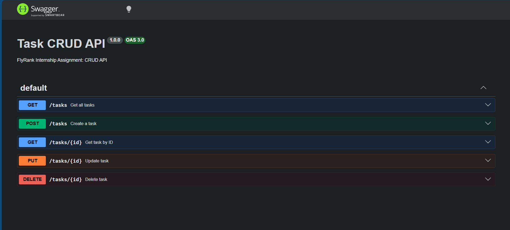
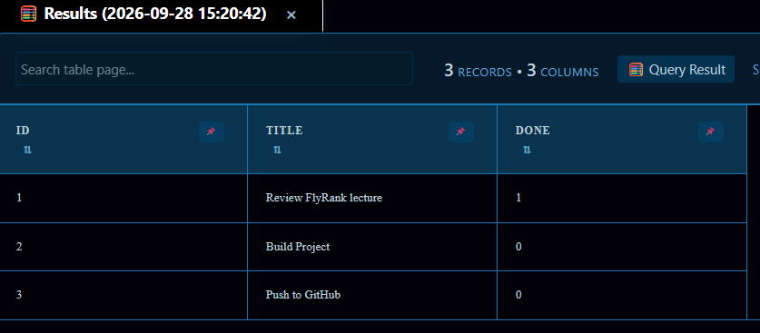

# FlyRank Backend Track - Week 2: Task CRUD API

An in-memory Task Management REST API built with Node.js and Express.

## How to Install and Run

Run the server with a single command:

```bash
pnpm add && node server.js
```

The server starts locally at `http://localhost:3000`.

## Endpoints

| Method | Path | Description | Success Code | Error Codes |
|---|---|---|---|---|
| `GET` | `/` | API discovery metadata | 200 | — |
| `GET` | `/health` | Health status check | 200 | — |
| `GET` | `/tasks` | List all tasks | 200 | — |
| `GET` | `/tasks/:id` | Get single task by ID | 200 | 404 |
| `POST` | `/tasks` | Create a new task | 201 | 400 |
| `PUT` | `/tasks/:id` | Update a task title or done state | 200 | 400, 404 |
| `DELETE` | `/tasks/:id` | Delete a task | 204 | 404 |
| `GET` | `/docs` | Interactive Swagger UI | 200 | — |

## Sample curl Output

Executing `curl -i http://localhost:3000/tasks`:

```http
HTTP/1.1 200 OK
X-Powered-By: Express
Content-Type: application/json; charset=utf-8
Content-Length: 177
ETag: W/"b1-3F7G19e2e6D1p0q7I"
Date: Mon, 28 Sep 2026 00:00:00 GMT
Connection: keep-alive
Keep-Alive: timeout=5

[
  {"id":1,"title":"Review FlyRank lecture","done":true},
  {"id":2,"title":"Build Project","done":false},
  {"id":3,"title":"Push to GitHub","done":false}
]
```

## Swagger UI

Interactive API testing documentation is available at `http://localhost:3000/docs`.



## Database Storage (SQLite)

This API uses **SQLite** via `better-sqlite3` for persistent storage:
- **Why SQLite?** It is a serverless, zero-configuration database contained entirely within a single file (`tasks.db`)[cite: 2]. It enables true persistence across restarts without requiring third-party database servers[cite: 2].
- **Zero-Setup Startup:** The database file and `tasks` table are automatically initialized and seeded on the first boot[cite: 2].


### Manual SQL Verification
Executed in SQLite Intelliview Extension for SQLite[cite: 2]:
```sql
SELECT COUNT(*) FROM tasks WHERE done = 0;
```
*Result returned the count of unfinished tasks directly from disk.*


### SQLite Intelliview Extension Screenshot
